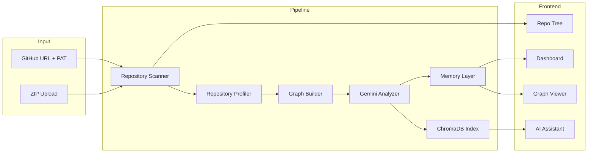

# Repository Intelligence Layer

AI-powered repository analysis platform that clones or uploads codebases, generates structured intelligence artifacts with **Gemini 2.5 Flash**, and provides an interactive dashboard with graph visualization, semantic search, and multi-agent chat.


<!-- Replace with actual screenshot after first run -->

## Features

- **GitHub cloning** — public and private repos (PAT authentication)
- **ZIP upload** — drag-and-drop repository archives
- **Repository scanner** — file tree, manifest parsing, static profiling
- **Graph builder** — static import/dependency graph + LLM architecture graph
- **Gemini analysis** — markdown report, profile, summary, and graph JSON
- **Interactive dashboard** — report, summary, profile, graph viewer, repo tree
- **AI Assistant** — multi-agent orchestration with RAG context
- **Knowledge Explorer** — ChromaDB semantic search and conversation history
- **Download endpoints** — export all intelligence artifacts
- **Persistent memory** — artifacts saved to disk; ChromaDB vector index

## Architecture



## Project Structure

```
├── backend/           # FastAPI application
│   ├── main.py        # API routes
│   ├── services/      # Scanner, profiler, graph builder, LLM, memory
│   ├── agents/        # Multi-agent orchestration
│   ├── memory/        # ChromaDB, RAG, conversations
│   └── tools/         # MCP-ready tool registry
├── frontend/          # React + Vite dashboard
├── Dockerfile         # Unified build for Hugging Face Spaces (port 7860)
└── docker-compose.yml # Local split-stack development
```

## Installation

### Prerequisites

- Python 3.11+
- Node.js 20+
- Git (for repository cloning)
- Gemini API key from [Google AI Studio](https://aistudio.google.com/)

### Local Setup

1. **Clone the repository**

```bash
git clone <your-repo-url>
cd "Software Engineer Agent"
```

2. **Configure environment**

```bash
cp .env.example backend/.env
# Edit backend/.env and set GEMINI_API_KEY
```

3. **Install backend dependencies**

```bash
cd backend
pip install -r requirements.txt
```

4. **Install frontend dependencies**

```bash
cd ../frontend
npm install
```

5. **Run locally (two terminals)**

Terminal 1 — Backend:
```bash
cd backend
uvicorn main:app --reload --host 127.0.0.1 --port 8000
```

Terminal 2 — Frontend:
```bash
cd frontend
npm run dev
```

Open **http://localhost:5173** — the Vite dev server proxies `/api` to the backend.

## Environment Variables

| Variable | Required | Description |
|----------|----------|-------------|
| `GEMINI_API_KEY` | Yes | Google Gemini API key for analysis, chat, and embeddings |
| `CORS_ORIGINS` | No | Comma-separated allowed origins (default: `*`) |
| `VITE_API_URL` | No | Frontend API base URL (empty = same origin / Vite proxy) |
| `VITE_API_PROXY` | No | Vite dev proxy target (default: `http://localhost:8000`) |

## API Endpoints

| Method | Path | Description |
|--------|------|-------------|
| `GET` | `/api/health` | Health check |
| `POST` | `/api/analyze-url` | Clone and analyze a GitHub repository |
| `POST` | `/api/analyze-zip` | Upload and analyze a ZIP archive |
| `GET` | `/api/download/{repo_id}/{type}` | Download artifact (`profile`, `graph`, `summary`, `report`) |
| `POST` | `/api/chat` | Multi-agent chat with RAG |
| `POST` | `/api/search` | Semantic search over indexed knowledge |
| `GET` | `/api/memory?repo_id=` | Vector index statistics |
| `GET` | `/api/conversations?repo_id=` | List chat sessions |
| `GET` | `/api/conversations/{session_id}` | Session message history |
| `GET` | `/api/tools` | Tool catalog |

## Docker

### Unified (Hugging Face / production)

```bash
docker build -t repo-intelligence .
docker run -p 7860:7860 -e GEMINI_API_KEY=your_key repo-intelligence
```

Open **http://localhost:7860**

### Split stack (development)

```bash
export GEMINI_API_KEY=your_key
docker compose up --build
```

- Frontend: **http://localhost:5173**
- Backend: **http://localhost:8000**

## Hugging Face Spaces Deployment

This project is ready for **free deployment** on [Hugging Face Spaces](https://huggingface.co/spaces) using the Docker SDK.

1. Create a new Space → select **Docker** as the SDK
2. Push this repository (or connect GitHub)
3. Ensure the root `Dockerfile` is used (builds frontend + serves backend on port **7860**)
4. Add a Space secret: `GEMINI_API_KEY` = your Gemini API key
5. Wait for the build to complete

The Space will serve both the React dashboard and FastAPI backend from a single container.

### HF Space Settings

- **SDK:** Docker
- **App port:** 7860
- **Secrets:** `GEMINI_API_KEY`

## Generated Artifacts

After analysis, the platform produces:

| File | Description |
|------|-------------|
| `repository_report.md` | Full markdown intelligence report |
| `repository_profile.json` | Languages, frameworks, APIs, modules, auth |
| `repository_summary.json` | Elevator pitch, features, workflows, risks |
| `repository_graph.json` | Architecture nodes, edges, flows, concepts |

Artifacts are stored in `backend/storage/repos/{repo_id}/` and available via the dashboard download buttons.

## Security

- ZIP extraction includes path-traversal protection
- GitHub PAT tokens are redacted from error messages
- Temporary clone/extract workspaces are cleaned up after analysis
- Private repos require a valid GitHub Personal Access Token

## License

MIT
