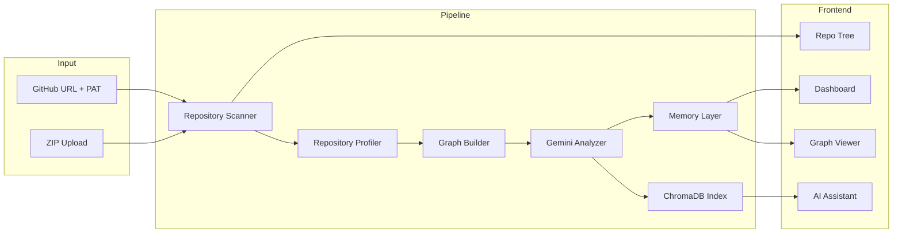

# Repository Intelligence Layer

### AI Agent System for Codebase Understanding & RAG-Based Repository Exploration

> Transform any GitHub repository into structured intelligence using static analysis, LLM reasoning, graph generation, and Retrieval-Augmented Generation (RAG).


> 🌐 **Live Demo:** https://huggingface.co/spaces/G-Madhuri/Software_Engineer_Agent

---

## 🚀 Overview

Repository Intelligence Layer is a full-stack AI application that analyzes software repositories and converts them into structured, searchable knowledge.

Users can provide a GitHub repository URL or upload a ZIP archive. The system performs static analysis, generates repository insights using **Gemini 2.5 Flash**, builds dependency graphs, creates a semantic knowledge base with **ChromaDB**, and enables conversational exploration through a multi-agent AI assistant.

---

## ✨ Features

- Analyze GitHub repositories or ZIP uploads
- Generate repository summaries, profiles, and architecture reports
- Visualize dependency and architecture graphs
- Semantic repository search using ChromaDB
- Multi-agent conversational RAG assistant
- Interactive React dashboard
- Download generated intelligence artifacts
- Docker & Hugging Face Spaces deployment

---

## 🏗️ Architecture



## Project Structure

```
├── backend/           # FastAPI application
│   ├── main.py        # API routes
│   ├── services/      # Scanner, profiler, graph builder, LLM, memory
│   ├── agents/        # Multi-agent orchestration
│   ├── memory/        # ChromaDB, RAG, conversations
│   └── tools/         # MCP-ready tool registry
├── frontend/          # React + Vite dashboard
├── Dockerfile         # Unified build for Hugging Face Spaces (port 7860)
└── docker-compose.yml # Local split-stack development
```

## 🛠️ Tech Stack

| Category | Technologies |
|----------|--------------|
| Frontend | React, Vite |
| Backend | FastAPI, Python |
| AI | Gemini 2.5 Flash |
| Vector Database | ChromaDB |
| Graph Processing | NetworkX |
| Deployment | Docker, Hugging Face Spaces |

---

## ⚙️ Installation

### Clone the repository

```bash
git clone <repository-url>
cd Repository-Intelligence-Layer
```

### Backend

```bash
cd backend
pip install -r requirements.txt
```

Create a `.env` file:

```env
GEMINI_API_KEY=your_api_key
```

Run the backend:

```bash
uvicorn main:app --reload
```

### Frontend

```bash
cd frontend
npm install
npm run dev
```

---

## 🐳 Docker

```bash
docker build -t repository-intelligence .

docker run -p 7860:7860 \
-e GEMINI_API_KEY=your_api_key \
repository-intelligence
```

---

## 📊 Generated Artifacts

After analysis, the platform generates:

| Artifact | Description |
|----------|-------------|
| `repository_report.md` | Comprehensive repository analysis |
| `repository_profile.json` | Languages, frameworks, dependencies |
| `repository_summary.json` | Executive repository summary |
| `repository_graph.json` | Architecture and dependency graph |

---

## 🔌 API Endpoints

| Method | Endpoint |
|--------|----------|
| GET | `/api/health` |
| POST | `/api/analyze-url` |
| POST | `/api/analyze-zip` |
| POST | `/api/chat` |
| POST | `/api/search` |

---

## 🔒 Security

- Secure ZIP extraction with path traversal protection
- GitHub PAT support for private repositories
- Temporary workspace cleanup
- Environment-based API key management

---


## ⭐ Key Highlights

- Hybrid **Static Analysis + LLM Reasoning** pipeline
- Multi-Agent AI architecture
- Retrieval-Augmented Generation (RAG)
- Semantic codebase search with ChromaDB
- Interactive repository graph visualization
- Fully containerized with Docker
- Deployable on Hugging Face Spaces

---

