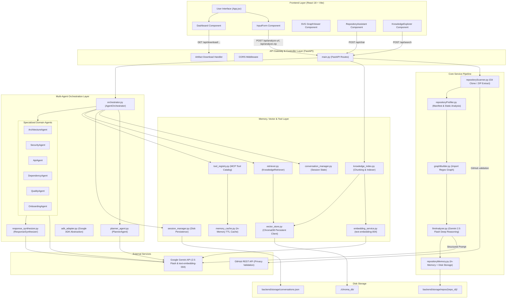

# Complete System Design & Interview Preparation Guide: Repository Intelligence Layer

---

## 1. PROJECT OVERVIEW

### Core Functionality
The **Repository Intelligence Layer** is an end-to-end AI-powered code analysis platform. It accepts a GitHub repository URL (with optional Personal Access Token for private repos) or an uploaded `.zip` codebase archive, performs automated multi-stage scanning, static profiling, and LLM-driven deep reasoning using **Gemini 2.5 Flash**, builds a semantic vector knowledge index using **ChromaDB** and **Google text-embedding-004**, and renders an interactive web dashboard for real-time visualization, vector search, artifact export, and multi-agent AI chat.

### Problem It Solves
Developers, code auditors, and tech leads entering a new codebase face a steep onboarding curve. Reading raw code manually or relying on outdated documentation takes hours to days. Existing tools either provide raw static analysis without context or simple LLM chats that lack codebase-wide topology, dependency graphs, structured artifact generation, and multi-agent RAG memory.

### Target Users
- **Software Engineers & Technical Leads**: Rapidly onboarding onto legacy or unfamiliar codebases.
- **Code Reviewers & Security Auditors**: Inspecting architecture patterns, authentication flows, and security risks.
- **System Architects & GenAI Developers**: Visualizing topological call flows and leveraging codebase RAG tools.

### Main Use Cases
1. **Instant Repository Onboarding**: Generating a comprehensive intelligence report, high-level summary, profile metadata, and interactive file tree.
2. **Code Topology Visualization**: Inspecting module imports, entry points, business workflows, and critical paths via an interactive graph viewer.
3. **Multi-Agent Conversational QA**: Asking complex architectural, security, or implementation questions answered by specialized agents with RAG context citations and full execution timeline visibility.
4. **Semantic Knowledge Exploration**: Searching indexed code chunks using vector similarity.
5. **Artifact Exporting**: Downloading structured JSON/Markdown intelligence artifacts (`repository_profile.json`, `repository_graph.json`, `repository_summary.json`, `repository_report.md`).

### Key Features
- **Dual Ingestion Engine**: Public/private GitHub cloning via `git clone --depth 1` + secure ZIP archive extraction with path-traversal safeguards.
- **Two-Stage Analysis Pipeline**: Fast regex/manifest static profiling + deep LLM reasoning with structured Pydantic schema enforcement.
- **Multi-Agent Orchestration**: Dynamic pipeline planning (`PlannerAgent`), 6 specialized domain agents (`ArchitectureAgent`, `SecurityAgent`, `ApiAgent`, `DependencyAgent`, `QualityAgent`, `OnboardingAgent`), parallel stage execution (`asyncio.gather`), and response synthesis (`ResponseSynthesizer`).
- **Hybrid RAG & Memory**: ChromaDB vector store + text-embedding-004 + session history persistence + in-memory TTL caching.
- **Model Context Protocol (MCP) Compatible Tool Registry**: Modular tool catalog (`repository_search`, `graph_query`, `dependency_lookup`, `file_reader`, `architecture_lookup`, `api_lookup`).
- **Interactive React Dashboard**: Custom SVG topology graph viewer, multi-agent chat timeline, markdown renderer, and vector explorer.

### Architecture Highlights
- **Layered Memory Model**: Disk-persisted artifacts + ChromaDB vector index + disk-backed JSON conversation sessions + in-memory TTL execution cache.
- **Deterministic LLM Output**: Uses Gemini's native `response_schema` mode backed by Pydantic models to guarantee valid JSON without parsing hacks.
- **Flexible Deployment**: Supports local split-stack (`docker-compose.yml`) and single-container production deployment for Hugging Face Spaces (`Dockerfile` with Nginx/FastAPI static mounting on port 7860).

### Implementation Status
- **IMPLEMENTED**: Ingestion (Git/ZIP), Static Scanner & Profiler, LLM Analysis (Gemini 2.5 Flash), ChromaDB Vector Store & Embedding Service (text-embedding-004), Multi-Agent Orchestration Engine, Memory & Session Persistence, MCP-ready Tool Registry, React Dashboard & Interactive SVG Graph Viewer.
- **PARTIALLY IMPLEMENTED**: MCP Tool Registry (implemented internally; external MCP server endpoint planned).
- **PLANNED / NOT CURRENTLY IMPLEMENTED**: User authentication (JWT/OAuth), role-based access control (RBAC), distributed queue (Celery/Redis) for background analysis jobs.

---

### 30-Second Interview Explanation

> *"Basically, this project is a Repository Intelligence and Codebase QA platform built with FastAPI, React, and Google Gemini 2.5 Flash. It ingests public/private GitHub repos or ZIP archives, performs static profiling and LLM deep reasoning to extract code topology, and stores the structured intelligence in ChromaDB using Google text-embedding-004. On top of this data layer, it runs a multi-agent orchestration engine—where a Planner agent dynamically routes queries across specialized domain agents like Security, Architecture, and API agents using a hybrid RAG pipeline—and exposes everything through an interactive React dashboard with custom SVG graph visualization."*

---

## 2. COMPLETE SYSTEM ARCHITECTURE

### High-Level Architecture Diagram (Mermaid)



---

### Detailed Component Analysis

#### 1. Frontend Layer (`frontend/src/`)
- **Technology**: React 18.3.1, Vite 5.3.1, Lucide React icons, Marked.js.
- **Responsibility**: Single-Page Application (SPA) rendering the analysis submission form, progress step state machine, intelligence dashboard, custom SVG graph viewer, multi-agent chat interface with execution timeline, and semantic vector explorer.
- **Why It Exists**: To provide an intuitive, high-performance visual workspace for inspecting code analysis and interacting with AI agents.
- **Communication**: Communicates asynchronously with the backend via `fetch` API (`api.js`).
- **Input Data**: User inputs (GitHub URL, GitHub Personal Access Token, `.zip` file upload, optional Gemini API Key, chat questions, search queries).
- **Output Data**: JSON requests to `/api/*`, UI state updates, visual DOM trees, SVG graph renders.
- **Implementation Detail**: Custom CSS design system (`index.css`) with glassmorphism styling, zero heavy external UI UI library dependencies.

#### 2. API Gateway & Controller Layer (`backend/main.py`)
- **Technology**: FastAPI 0.115.6, Uvicorn 0.34.0, Pydantic 2.10.4.
- **Responsibility**: Exposes REST API endpoints, handles CORS, processes file uploads (`UploadFile`), header extraction (`x-gemini-key`), exception handling, background task file cleanup, and serves static frontend assets in production.
- **Why It Exists**: Serves as the central entry point and control plane connecting the React UI to internal services.
- **Communication**: HTTP/HTTPS requests from client; calls backend services directly in Python.
- **Input Data**: HTTP Requests (JSON payloads, multipart form data, headers).
- **Output Data**: HTTP Responses (JSON objects, file streams, HTTP status codes).

#### 3. Repository Ingestion & Scanner Service (`backend/services/repositoryScanner.py`)
- **Technology**: Python `subprocess`, `zipfile`, `httpx`, `tempfile`, `shutil`, `stat`.
- **Responsibility**: GitHub URL parsing, GitHub API privacy verification, git shallow cloning (`git clone --depth 1`), safe ZIP extraction with path traversal validation, text vs binary file identification (`is_text_file`), recursive tree scanning (`scan_directory`), and OS-agnostic cleanup (`handle_remove_readonly`).
- **Why It Exists**: Isolates external code ingestion and safeguards the backend against malicious archive uploads or token leaks.
- **Communication**: Calls GitHub REST API via `httpx`; executes system `git` via `subprocess`.
- **Input Data**: GitHub URL, optional PAT, ZIP binary stream.
- **Output Data**: File tree dictionary (`tree`), flat list of readable text files (`files`), temporary workspace root path (`scan_root`).

#### 4. Static Repository Profiler (`backend/services/repositoryProfiler.py`)
- **Technology**: Python Regex (`re`), `json`.
- **Responsibility**: Extension-to-language frequency mapping (`EXTENSION_MAP`), manifest parsing (`package.json` for Node, `requirements.txt` for Python, `go.mod` for Go, `Cargo.toml` for Rust), database signature detection, infrastructure detection (`Dockerfile`, `docker-compose.yml`, GitHub Workflows).
- **Why It Exists**: Quickly builds a deterministic baseline metadata profile of the project without spending LLM tokens.
- **Communication**: In-process functional invocation.
- **Input Data**: Flat list of text files from scanner.
- **Output Data**: `static_profile` dictionary (languages, frameworks, databases, package managers, infrastructure).

#### 5. Import Graph Builder (`backend/services/graphBuilder.py`)
- **Technology**: Python Regex (`re`).
- **Responsibility**: Extracts module imports from Python (`PYTHON_IMPORT_RE`) and JS/TS (`JS_IMPORT_RE`), maps relative and package import targets to local project files, builds initial node and edge topology.
- **Why It Exists**: Reconstructs file-level dependency graphs deterministically.
- **Communication**: In-process functional invocation.
- **Input Data**: Flat list of text files.
- **Output Data**: `static_graph` dictionary containing `nodes` and `edges`.

#### 6. LLM Deep Reasoning Analyzer (`backend/services/llmAnalyzer.py`)
- **Technology**: `google-genai` SDK 1.14.0, Pydantic 2.10.4.
- **Responsibility**: Prioritizes structurally critical code files (`select_important_files`), truncates context to avoid token overflows, constructs structured prompt, invokes **Gemini 2.5 Flash** using native `response_schema` mode (`AnalysisResponse`).
- **Why It Exists**: Performs deep semantic reasoning to generate the full markdown report, architectural profile, summary, and conceptual topology graph.
- **Communication**: Outbound HTTPS calls to Google Gemini API (`gemini-2.5-flash`).
- **Input Data**: Code file contents, tree structure, static profile, Gemini API key.
- **Output Data**: JSON dictionary containing `report`, `profile`, `summary`, `graph`.

#### 7. Artifact Persistence Service (`backend/services/repositoryMemory.py`)
- **Technology**: Python File I/O, `json`, in-memory dictionary.
- **Responsibility**: In-memory caching and disk persistence of generated artifacts in `backend/storage/repos/{repo_id}/`.
- **Why It Exists**: Ensures generated artifacts persist across server restarts and are instantly downloadable.
- **Communication**: File system write/read operations.
- **Input Data**: `repo_id`, `profile`, `graph`, `summary`, `report`.
- **Output Data**: Persisted JSON and Markdown files on disk.

#### 8. Multi-Agent Orchestration Engine (`backend/agents/orchestrator.py`)
- **Technology**: Python `asyncio`, `time`, `logging`.
- **Responsibility**: Coordinates multi-agent workflow: Planner execution -> Memory retrieval -> Semantic search -> Tool invocation -> Parallel agent execution (`asyncio.gather`) -> Response synthesis. Captures per-step latency metrics and builds execution timeline.
- **Why It Exists**: Implements modular, dynamic AI decision-making instead of a rigid single-prompt approach.
- **Communication**: In-process call dispatch to agents, tools, memory, and synthesizer.
- **Input Data**: User query, `repo_id`, `session_id`, repository artifacts, Gemini key.
- **Output Data**: Synthesized markdown answer, agent decisions, timeline, references.

#### 9. Specialized Domain Agents (`backend/agents/`)
- **Agents**:
  - `PlannerAgent` (`planner_agent.py`): Generates `PlannerDecision` JSON.
  - `ArchitectureAgent` (`architecture_agent.py`): Analyzes component interactions and business flows.
  - `SecurityAgent` (`security_agent.py`): Analyzes auth, secrets, injection, and security risks.
  - `ApiAgent` (`api_agent.py`): Analyzes HTTP routes, methods, payloads, and third-party APIs.
  - `DependencyAgent` (`dependency_agent.py`): Analyzes libraries, frameworks, and infrastructure.
  - `QualityAgent` (`quality_agent.py`): Analyzes code complexity, dead code, and testability.
  - `OnboardingAgent` (`onboarding_agent.py`): Generates developer entry point walkthroughs.
  - `ResponseSynthesizer` (`response_synthesizer.py`): Synthesizes outputs into final response.
- **Technology**: `google-genai` SDK, Pydantic schemas, `BaseAgent` abstract class.
- **Why They Exist**: Domain separation of concerns produces higher quality, focused analysis compared to a single generic prompt.

#### 10. Vector Database & RAG Subsystem (`backend/memory/`)
- **Technology**: ChromaDB 1.5.9, Google `text-embedding-004`, Pydantic.
- **Modules**:
  - `vector_store.py`: Persistent ChromaDB client (`chromadb.PersistentClient`) with cosine similarity.
  - `embedding_service.py`: Generates 768-dim embeddings via `text-embedding-004`.
  - `knowledge_index.py`: Chunking (1000 chars, 100 overlap) and batch embedding ingestion (batch size 50).
  - `retriever.py`: Vector similarity retrieval with metadata filtering.
  - `conversation_manager.py` & `session_manager.py`: Multi-session history tracking with disk persistence (`conversations.json`).
  - `memory_cache.py`: In-memory TTL cache for tool results.

---

## 3. EVERY TECHNOLOGY USED

| Technology | Where Used | Purpose | Why This Choice | Alternative | Trade-off |
| :--- | :--- | :--- | :--- | :--- | :--- |
| **Python 3.11+** | Backend Runtime | Core backend programming language | High ecosystem support for AI/ML, FastAPI, and data manipulation | Node.js (TypeScript) | Slower raw execution than Go/Rust, but vastly superior AI library ecosystem |
| **FastAPI (0.115.6)** | Backend Framework | Async Web API Framework | Native ASGI async performance, automatic OpenAPI docs, Pydantic integration | Flask / Express.js | Slightly higher initial learning curve than Flask |
| **Uvicorn (0.34.0)** | Backend Server | Lightning-fast ASGI Server | Asynchronous non-blocking event loop execution | Gunicorn / Hypercorn | Single process by default without Gunicorn worker manager |
| **Pydantic (2.10.4)** | Backend Validation | Data validation & LLM response schema enforcement | Strict type enforcement, zero-overhead Rust core in v2, native Gemini schema compatibility | Marshmallow / Cerberus | Strict schema validation fails if LLM omits required fields without fallback |
| **google-genai (1.14.0)**| Backend AI SDK | Official Google GenAI SDK for Gemini 2.5 Flash & text-embedding-004 | Official unified SDK for modern Gemini models supporting `response_schema` | Legacy `google-generativeai` / LangChain | Vendor lock-in to Google AI platform |
| **ChromaDB (1.5.9)** | Backend Vector DB | Embedded persistent vector storage for RAG codebase search | Zero-config embedded vector DB with disk persistence, HNSW indexing, and cosine metric | Pinecone / Qdrant / Pgvector | Runs in-process; limited distributed horizontal scaling compared to Pinecone |
| **httpx (0.28.1)** | Backend HTTP Client | Async HTTP client for GitHub API validation | Modern async/await support compatible with FastAPI event loop | Requests | Requires async event loop management |
| **python-multipart (0.0.20)**| Backend Middleware| Parsing multipart form data for ZIP uploads | Required by FastAPI for handling binary file uploads | Built-in cgi (deprecated in Python 3.13) | Third-party dependency requirement |
| **React (18.3.1)** | Frontend Framework | Component-based UI rendering | Declarative component model, virtual DOM efficiency, rich ecosystem | Vue.js / Angular | Requires client-side bundle compilation |
| **Vite (5.3.1)** | Frontend Build Tool | Next-Gen Frontend Tooling & Dev Server | Extremely fast HMR (Hot Module Replacement) powered by ES Modules and esbuild | Webpack | Configuration differs from standard Create React App setup |
| **Lucide React (0.395.0)**| Frontend UI | Modern icon library | Clean vector icons, small footprint, tree-shakeable | FontAwesome / React Icons | Fixed icon style set |
| **Marked (12.0.2)** | Frontend Renderer | Markdown to HTML parser | Lightweight, fast client-side markdown parsing for AI reports | React-Markdown | Must sanitize HTML if rendering user-generated content |
| **Git CLI** | Backend Subprocess | Cloning remote GitHub repositories | Native git protocol execution supporting shallow `--depth 1` clones | PyGithub / GitPython | Requires Git binary pre-installed on server environment |
| **Docker / Docker Compose**| DevOps & Hosting | Containerization & Orchestration | Unified reproducible runtime environment for local dev and Hugging Face deployment | Bare Metal / VM deployment | Image build time and container size overhead |

---

## 4. "WHY DID YOU CHOOSE THIS TECHNOLOGY?"

### 1. Why FastAPI instead of Flask or Express.js?
- **Interview Answer**: *"I chose FastAPI because of its native asynchronous ASGI support and first-class integration with Pydantic. Since our system orchestrates asynchronous AI API calls, shallow git clones, and parallel agent execution using `asyncio.gather`, FastAPI handles concurrent requests without blocking worker threads. Furthermore, Pydantic models automatically validate incoming requests and allow us to pass structured JSON schemas directly to Gemini's `response_schema` configuration."*
- **Trade-off**: *"FastAPI has slightly more strict typing overhead compared to Flask, and error handling for unexpected Pydantic schema validation failures requires explicit exception handler overrides."*
- **When I would choose the alternative**: *"I would use Flask for simple synchronous microservices or Express.js if the entire engineering team was standardized on JavaScript/Node.js."*

### 2. Why Google Gemini 2.5 Flash instead of OpenAI GPT-4o or Claude 3.5 Sonnet?
- **Interview Answer**: *"I selected Gemini 2.5 Flash because it provides a massive 1-million-token context window alongside native structured JSON output (`response_schema`) at a fraction of the cost and latency of GPT-4o. When analyzing entire codebases, passing complete directory trees and multiple source files in a single prompt requires a large context window and low latency."*
- **Trade-off**: *"Relying exclusively on Gemini couples our LLM layer to Google AI Studio, meaning any provider downtime directly affects our analysis service unless a fallback provider is implemented."*
- **When I would choose the alternative**: *"I would choose Claude 3.5 Sonnet for ultra-complex multi-file code editing tasks or GPT-4o if strict OpenAI enterprise compliance policies were mandated."*

### 3. Why ChromaDB instead of Pinecone or Pgvector?
- **Interview Answer**: *"I chose ChromaDB because it operates as an embedded, zero-configuration vector database that persists directly to local disk (`./chroma_db`). This fits perfectly into single-container deployments like Hugging Face Spaces or lightweight local docker-compose environments without requiring an external managed cloud database cluster."*
- **Trade-off**: *"In-process vector databases share memory and storage with the application process, which limits independent horizontal scaling of vector query workers."*
- **When I would choose the alternative**: *"I would switch to Pgvector if the app already used PostgreSQL as its main relational database, or Pinecone/Qdrant for a enterprise deployment with millions of vector embeddings."*

### 4. Why Vite + React instead of Next.js or Create React App?
- **Interview Answer**: *"I chose Vite + React because our application is a Client-Side Rendered (CSR) Single-Page Application dashboard where all data is fetched dynamically via API endpoints. Vite leverages native ES modules during development, providing instant startup times and fast Hot Module Replacement without the unnecessary complexity of Next.js server-side rendering (SSR) setup."*
- **Trade-off**: *"Vite CSR does not provide server-side HTML pre-rendering for SEO, which is irrelevant for a behind-the-login intelligence dashboard."*
- **When I would choose the alternative**: *"I would use Next.js if the application required public SEO landing pages or Server Components for initial HTML stream rendering."*

---

## 5. COMPLETE REQUEST/DATA FLOW

### Flow 1: Repository Submission & Analysis (`/api/analyze-url`)

```
[User Clicks "Analyze Repository"]
       │
       ▼
1. Frontend Component (`InputForm.jsx`)
       │ Form validation -> HTTP POST /api/analyze-url
       ▼
2. Backend Route (`backend/main.py:analyze_git_url`)
       │ Receives payload: { url: "...", token: "..." }
       │ Extracts Header: x-gemini-key
       ▼
3. Privacy Check (`services/repositoryScanner.py:check_repository_privacy`)
       │ Asynchronous HTTP GET to https://api.github.com/repos/owner/repo
       │ Validates public/private access with optional PAT
       ▼
4. Repository Cloning (`services/repositoryScanner.py:clone_repository`)
       │ Executes: git clone --depth 1 https://[token]@github.com/owner/repo.git into temp_dir
       ▼
5. File Tree Scanning (`services/repositoryScanner.py:scan_directory`)
       │ Filters IGNORED_DIRS (node_modules, .git) & IGNORED_EXTS (binary/images)
       │ Reads text files <= 100KB -> Returns tree structure & flat_files list
       ▼
6. Static Profiling & Import Graph (`services/repositoryProfiler.py` & `graphBuilder.py`)
       │ Extension counting, package.json / requirements.txt manifest parsing
       │ Regex import extraction -> Returns static_profile & static_graph
       ▼
7. Gemini Deep Analysis (`services/llmAnalyzer.py:analyze_repository`)
       │ select_important_files() prioritizes manifests & entrypoints
       │ Invokes Gemini 2.5 Flash with response_schema=AnalysisResponse
       │ Returns structured report, profile, summary, graph
       ▼
8. Persistence Layer (`services/repositoryMemory.py:memory_service.store`)
       │ Saves artifacts to memory cache & disk: backend/storage/repos/{repo_id}/
       ▼
9. Vector Indexing (`memory/knowledge_index.py:KnowledgeIndexBuilder.build_index`)
       │ Chunks report, summary, profile, & code files (1000 chars, 100 overlap)
       │ Generates embeddings via EmbeddingService (text-embedding-004) in batches of 50
       │ Writes vectors & metadata to ChromaDB collection (repo_{repo_id})
       ▼
10. Temporary Workspace Cleanup (`backend/main.py` finally block)
       │ shutil.rmtree(temp_dir) cleans temporary clone folder safely
       ▼
11. Response to Frontend (`Dashboard.jsx`)
       │ Returns JSON: { success: true, repo_id, project_name, tree, data }
       │ App state transitions to 'success' -> Renders Dashboard tabs
```

---

### Flow 2: Multi-Agent AI Chat (`/api/chat`)

```
[User Submits Question in AI Assistant Tab]
       │
       ▼
1. Frontend Component (`RepositoryAssistant.jsx`)
       │ HTTP POST /api/chat -> { repo_id, question, session_id }
       ▼
2. Backend Route (`backend/main.py:chat_with_repo`)
       │ Adds user message to `conversation_manager`
       │ Instantiates GeminiLLMClient & AgentOrchestrator
       ▼
3. Orchestration Step 1: Planner Agent (`backend/agents/planner_agent.py`)
       │ PlannerAgent evaluates user query against repo summary & profile
       │ Outputs PlannerDecision JSON: selected_agents, execution_order, tools, RAG flags
       ▼
4. Orchestration Step 2: Memory & RAG Retrieval (`backend/memory/retriever.py`)
       │ Fetches past conversation turns if retrieve_memory is true
       │ Executes vector search in ChromaDB via KnowledgeRetriever if run_semantic_search is true
       ▼
5. Orchestration Step 3: Tool Execution (`backend/tools/tool_registry.py`)
       │ Executes tools requested by Planner (e.g., file_reader, graph_query)
       │ Checks memory_cache for cached tool outputs
       ▼
6. Orchestration Step 4: Specialized Agent Execution (`backend/agents/orchestrator.py`)
       │ Parallel execution of selected agents per stage via asyncio.gather()
       │ E.g., Stage 1: SecurityAgent & ApiAgent in parallel
       │ E.g., Stage 2: ArchitectureAgent using Stage 1 context
       ▼
7. Orchestration Step 5: Response Synthesizer (`backend/agents/response_synthesizer.py`)
       │ Compiles agent reports, RAG context, and tool outputs
       │ Generates unified markdown answer + confidence score + agent attributions
       ▼
8. Persistence & Response
       │ Saves assistant response record to conversation_manager & disk (conversations.json)
       │ Returns JSON: { answer, summary, agents_used, confidence, references, timeline }
       ▼
9. Frontend UI Update (`RepositoryAssistant.jsx`)
       │ Renders assistant answer, populates execution timeline modal, displays citation chips
```

---

## 6. FRONTEND SYSTEM DESIGN

### Directory Structure
```
frontend/
├── dist/                   # Static production bundle output
├── index.html              # HTML entry point (UTF-8, viewport, fonts)
├── nginx.conf              # Nginx web server config (production routing)
├── package.json            # Node.js dependencies and scripts
├── vite.config.js          # Vite build configuration & API proxy setup
└── src/
    ├── App.jsx             # Root container & top-level state machine
    ├── api.js              # Centralized API base URL resolver helper
    ├── index.css           # Global CSS tokens, glassmorphism, responsive styles
    ├── main.jsx            # React DOM entry point
    └── components/
        ├── Dashboard.jsx           # Main tabbed dashboard wrapper
        ├── GraphViewer.jsx         # Custom SVG code topology graph viewer
        ├── InputForm.jsx           # GitHub URL / ZIP submission form
        ├── KnowledgeExplorer.jsx   # Vector search & chat history explorer
        ├── RepoTree.jsx            # Collapsible repository file tree
        └── RepositoryAssistant.jsx # Multi-agent AI chat interface
```

### Component Hierarchy & State Flow
- **`App.jsx`** (State: `appState` [`idle`|`loading`|`error`|`success`], `analysisResult`, `error`, `currentStep`)
  - **`InputForm.jsx`** (Renders when `appState === 'idle'` or `'error'`)
  - **Progress Panel** (Renders step animation when `appState === 'loading'`)
  - **Dashboard Layout** (Renders when `appState === 'success'`)
    - **`RepoTree.jsx`** (Sidebar component rendering interactive file tree)
    - **`Dashboard.jsx`** (Tab manager for active view)
      - *Tab 1*: Intelligence Report Markdown view (`marked` rendered HTML)
      - *Tab 2*: Knowledge Summary cards (Elevator pitch, Features, Workflows, Risks, Start points)
      - *Tab 3*: Repository Profile metadata cards & API endpoint explorer
      - *Tab 4*: **`GraphViewer.jsx`** (Interactive SVG node/edge topology viewer with drag, zoom, filter, and inspector)
      - *Tab 5*: **`RepositoryAssistant.jsx`** (AI Chat UI with multi-agent timeline step debugging and citation chips)
      - *Tab 6*: **`KnowledgeExplorer.jsx`** (Vector database semantic search interface & conversation session loader)

### State Management Strategy
- **Local vs Global State**: Built using native React hooks (`useState`, `useEffect`, `useMemo`, `useRef`). Global application state (`analysisResult`, `appState`) lives at the top level in `App.jsx` and flows down via props, avoiding third-party state managers like Redux or Zustand.
- **Form Handling & Validation**: Controlled form inputs in `InputForm.jsx` with input sanitization, GitHub URL validation regex, and file format checking (`.zip`).

---

## 7. BACKEND SYSTEM DESIGN

### Directory Structure
```
backend/
├── main.py                 # FastAPI application routes & middleware
├── requirements.txt        # Python dependency manifest
├── Dockerfile              # Backend standalone container definition
├── storage/                # Persisted storage folder
│   ├── conversations.json  # Saved chat sessions
│   └── repos/              # Repository artifacts (/repo_id/...)
├── adapters/               # Agent Framework Adapters
│   ├── adk_adapter.py      # Google ADK application adapter
│   ├── agent_adapter.py    # ADK agent wrapper
│   └── planner_adapter.py  # ADK planner wrapper
├── agents/                 # Multi-Agent Framework
│   ├── base_agent.py       # Abstract base agent class
│   ├── llm_client.py       # Gemini API client wrapper
│   ├── orchestrator.py     # Multi-agent execution orchestrator
│   ├── planner_agent.py    # Pipeline decision planner
│   ├── architecture_agent.py
│   ├── security_agent.py
│   ├── api_agent.py
│   ├── dependency_agent.py
│   ├── quality_agent.py
│   ├── onboarding_agent.py
│   └── response_synthesizer.py
├── memory/                 # Vector Store, RAG & Session Memory
│   ├── conversation_manager.py # In-memory session tracker
│   ├── embedding_service.py    # Gemini text-embedding-004 wrapper
│   ├── knowledge_index.py     # Code chunker & ChromaDB indexer
│   ├── memory_cache.py        # In-memory TTL cache
│   ├── retriever.py           # Vector similarity search retriever
│   ├── session_manager.py     # Disk persistence coordinator
│   └── vector_store.py        # Persistent ChromaDB client wrapper
├── services/               # Core Static & LLM Analysis Services
│   ├── graphBuilder.py        # Import dependency graph builder
│   ├── llmAnalyzer.py         # Gemini 2.5 Flash repository analyzer
│   ├── repositoryMemory.py    # Artifact disk storage service
│   ├── repositoryProfiler.py  # Static manifest & file profiler
│   └── repositoryScanner.py   # Git clone, ZIP extract, & file scanner
└── tools/                  # MCP-Ready Tool System
    ├── base_tool.py
    ├── tool_registry.py
    ├── repository_search_tool.py
    ├── file_reader_tool.py
    ├── graph_query_tool.py
    ├── dependency_lookup_tool.py
    ├── architecture_lookup_tool.py
    └── api_lookup_tool.py
```

### Architectural Pattern Classification
The backend is structured as a **Modular Monolith**. 
- **Why**: All services (scanner, profiler, LLM analyzer, multi-agent engine, vector database) run within a single FastAPI application process for maximum efficiency, zero network latency between services, and simplified deployment.
- **Microservices Readiness**: Components communicate via clean service interfaces (`memory_service`, `tool_registry`, `orchestrator`). The agent orchestrator and vector database can easily be extracted into independent microservices if traffic demands it.

---

## 8. DATABASE & MEMORY DESIGN

### Memory & Storage Architecture

```
┌────────────────────────────────────────────────────────────────────────┐
│                        FastAPI Memory Layer                            │
├──────────────────────────────────┬─────────────────────────────────────┤
│     In-Memory Caches             │      Disk Persistence               │
├──────────────────────────────────┼─────────────────────────────────────┤
│ 1. RepositoryMemoryService       │ 1. Artifact Files                   │
│    `_memory_db` Dict             │    `storage/repos/{repo_id}/`       │
│                                  │    - profile.json                    │
│ 2. MemoryCache                   │    - graph.json                      │
│    TTL tool result cache         │    - summary.json                    │
│                                  │    - report.md                       │
│ 3. ConversationManager           │                                     │
│    `_sessions` Dict              │ 2. Conversation Sessions            │
│                                  │    `storage/conversations.json`      │
│                                  │                                     │
│                                  │ 3. Vector Database                  │
│                                  │    `./chroma_db/` (PersistentClient) │
└──────────────────────────────────┴─────────────────────────────────────┘
```

### ChromaDB Collection Schema
- **Collection Naming**: `repo_{repo_id_with_underscores}` (e.g., `repo_3f8a2b1c_...`).
- **Distance Metric**: Cosine Distance (`metadata={"hnsw:space": "cosine"}`).
- **Indexed Document Categories**:
  - `report`: Markdown report split into 1000-char chunks.
  - `summary`: Elevator pitch, core features, developer start points.
  - `architecture`: High-level pattern metadata.
  - `authentication`: Security & auth methods detected.
  - `api`: API endpoints and HTTP routes.
  - `dependency`: Package dependencies and libraries.
  - `business_flow`: Extracted workflow steps from graph.
  - `concept`: Architectural concepts and associated files.
  - `file`: Source code file contents split into sliding window chunks.

---

## 9. API DESIGN

| Method | Endpoint | Purpose | Request Body / Parameters | Response Output | Auth | Main Logic |
| :--- | :--- | :--- | :--- | :--- | :--- | :--- |
| `GET` | `/api/health` | Health Check | None | `{"status": "healthy"}` | None | Returns healthy status |
| `POST` | `/api/analyze-url` | Clone & analyze GitHub repo | `{ "url": str, "token": Optional[str] }`<br>Header: `x-gemini-key` | `{ "success": true, "repo_id": str, "tree": dict, "data": dict }` | Optional GitHub PAT | Validates privacy, shallow clones repo, scans files, profiles manifests, calls Gemini 2.5 Flash, indexes ChromaDB |
| `POST` | `/api/analyze-zip` | Upload & analyze ZIP file | `file: UploadFile` (Multipart)<br>Header: `x-gemini-key` | `{ "success": true, "repo_id": str, "tree": dict, "data": dict }` | Optional Gemini Key Header | Validates path safety, extracts ZIP, scans files, profiles manifests, calls Gemini 2.5 Flash, indexes ChromaDB |
| `GET` | `/api/download/{repo_id}/{artifact}` | Download intelligence file | `repo_id: str`<br>`artifact`: `profile`│`graph`│`summary`│`report` | File Download Stream (`FileResponse`) | None | Fetches artifact from `RepositoryMemoryService`, generates file response, cleans temp file asynchronously |
| `POST` | `/api/chat` | Multi-agent QA with RAG | `{ "repo_id": str, "question": str, "session_id": Optional[str] }` | `{ "answer": str, "summary": str, "agents_used": list, "timeline": list, ... }` | Optional Gemini Key Header | Runs `PlannerAgent`, retrieves vector search & conversation memory, executes specialized agents in parallel, synthesizes response |
| `POST` | `/api/search` | Vector search over codebase | `{ "repo_id": str, "query": str, "top_k": int, "category": Optional[str] }` | `{ "query": str, "results": list, "latency_ms": int }` | Optional Gemini Key Header | Generates embedding via `text-embedding-004`, queries ChromaDB vector store, returns top_k matching chunks |
| `GET` | `/api/memory` | Get vector index stats | Query param: `repo_id=str` | `{ "repo_id": str, "indexed_chunks": int, "storage_path": str }` | None | Returns document count in ChromaDB collection |
| `GET` | `/api/conversations` | List chat sessions for repo | Query param: `repo_id=str` | `{ "repo_id": str, "sessions": list }` | None | Filters active conversation sessions from `ConversationManager` |
| `GET` | `/api/conversations/{id}` | Get session message history | Path param: `session_id=str` | `{ "session_id": str, "history": list }` | None | Retrieves message records from `SessionManager` |
| `GET` | `/api/tools` | List registered MCP tools | None | `{ "tools": list, "count": int }` | None | Returns catalog of registered repository tools from `ToolRegistry` |

---

## 10. AI / ML / GENAI ARCHITECTURE

### Multi-Agent Pipeline Execution Flow

```
                                [User Question]
                                       │
                                       ▼
                             ┌───────────────────┐
                             │   PlannerAgent    │
                             └─────────┬─────────┘
                                       │ Generates execution plan
                                       ▼
             ┌─────────────────────────┼─────────────────────────┐
             │                         │                         │
             ▼                         ▼                         ▼
   ┌───────────────────┐     ┌───────────────────┐     ┌───────────────────┐
   │ Conversation Mem  │     │ Vector Search RAG │     │   Tool Registry   │
   │ (Past Chat Turns) │     │ (text-embedding)  │     │(file_reader, etc.)│
   └─────────┬─────────┘     └─────────┬─────────┘     └─────────┬─────────┘
             │                         │                         │
             └─────────────────────────┼─────────────────────────┘
                                       │ Augmented Context
                                       ▼
                       ┌───────────────────────────────┐
                       │ Parallel Stage Execution      │
                       │ (asyncio.gather)              │
                       ├───────────────┬───────────────┤
                       │ SecurityAgent │   ApiAgent    │
                       ├───────────────┼───────────────┤
                       │ Architecture  │ QualityAgent  │
                       └───────────────┬───────────────┘
                                       │ Specialized Agent Reports
                                       ▼
                             ┌───────────────────┐
                             │ResponseSynthesizer│
                             └─────────┬─────────┘
                                       │ Synthesized Markdown Answer
                                       ▼
                                [Final Output]
```

### Key AI Implementation Details
1. **Model Selection**:
   - Reasoning & Chat: **Gemini 2.5 Flash** (`model='gemini-2.5-flash'`)
   - Vector Embeddings: **Google text-embedding-004** (`model='text-embedding-004'`, 768 dimensions)
2. **Structured JSON Generation**:
   - Implemented via Gemini's native `response_schema` config parameter passed to `genai.Client.models.generate_content()`.
   - Guaranteed adherence to Pydantic models (`AnalysisResponse`, `PlannerDecision`, `SynthesizedResponse`).
3. **Context Management Strategy**:
   - `select_important_files()` prioritizes manifest files (`package.json`, `requirements.txt`) and entry points (`main.py`, `server.js`).
   - Hard 50KB limit per individual file content ingestion.
   - Total prompt character budget capped at 600,000 chars (~150,000 tokens) to guarantee fast generation and stay well within rate limits.

---

## 11. EXTERNAL API INTEGRATION

### 1. GitHub REST API (`https://api.github.com/repos/{owner}/{repo}`)
- **Purpose**: Validating repository existence and checking public/private privacy status before cloning.
- **Authentication**: Optional `Authorization: token {PAT}` header.
- **Failure Handling**: HTTP 404 returns `private_requires_auth` prompt to the user; API errors raise FastAPI HTTP 502 Bad Gateway.

### 2. Google Gemini API (`gemini-2.5-flash` & `text-embedding-004`)
- **Purpose**: Base code analysis, multi-agent reasoning, response synthesis, and vector embedding generation.
- **Authentication**: `GEMINI_API_KEY` environment variable or `x-gemini-key` request header.
- **Failure Handling**: Wraps API errors (`RESOURCE_EXHAUSTED`, `API_KEY_INVALID`), returns explicit user recommendations, and implements fallback execution paths in the agent orchestrator.

---

## 12. SECURITY

### Implemented Security Mechanisms
- **Path Traversal Protection**: `extract_zip()` verifies that all extracted file target paths stay strictly within the target directory bounds, preventing Zip Slip vulnerabilities.
- **Token Redaction in Logs**: `sanitize_git_error()` strips Personal Access Tokens from Git CLI error outputs before logging or returning HTTP responses.
- **Temporary Workspace Cleanup**: Temporary directories created via `tempfile.mkdtemp()` are deleted in `finally` blocks using `shutil.rmtree` with Windows read-only fallback handlers (`handle_remove_readonly`).
- **Configurable CORS**: `CORSMiddleware` configured with environment-based allowed origins (`CORS_ORIGINS`).

### Missing / Planned Security Improvements
- **User Authentication**: Currently no JWT/OAuth user authentication layer for session isolation.
- **Rate Limiting**: No per-IP or per-user rate limiting middleware (e.g., slowapi).
- **Prompt Injection Defense**: Input prompts are passed directly to LLM agents without explicit adversarial sanitization.

---

## 13. SCALABILITY

### Current Capacity & Bottlenecks
- **100 Users**: Current implementation handles 100 intermittent users comfortably.
- **10,000 Users**: Bottlenecks arise from synchronous disk storage (`conversations.json`), local ChromaDB file locking, and single-process Uvicorn execution.

### Production Scaling Roadmap
1. **Database Migration**: Replace local ChromaDB with managed vector DB (Qdrant / Pinecone) and local JSON storage with PostgreSQL.
2. **Asynchronous Job Queue**: Offload repository cloning and LLM analysis to Celery worker queues backed by Redis.
3. **Container Orchestration**: Deploy FastAPI backend as stateless container instances behind an Application Load Balancer (ALB).

---

## 14. RELIABILITY & FAILURE HANDLING

- **Agent Retries**: `_run_agent_with_retry()` executes failed specialized agents up to 2 retries with exponential backoff (`asyncio.sleep(0.5)`).
- **Planner Fallback**: If `PlannerAgent` fails to parse or execute, the orchestrator falls back to a default execution plan running all agents.
- **Synthesizer Fallback**: If `ResponseSynthesizer` fails, raw specialized agent responses are combined into a fallback markdown answer.
- **Non-Fatal RAG Failures**: If ChromaDB vector indexing fails, analysis completes successfully and logs a warning.

---

## 15. PERFORMANCE

- **File Prioritization**: `select_important_files()` ranks manifests and entry points first.
- **Batch Embedding Generation**: `KnowledgeIndexBuilder` batches text embedding requests in groups of 50.
- **In-Memory Caching**: `MemoryCache` caches tool execution results with TTL support (300 seconds).

---

## 16. DEPLOYMENT & DEVOPS

### Deployment Models
1. **Local Split-Stack (`docker-compose.yml`)**:
   - Backend on `http://localhost:8000`
   - Frontend Vite dev server on `http://localhost:5173`
2. **Unified Hugging Face Spaces Container (`Dockerfile`)**:
   - Multi-stage build: Stage 1 builds Vite frontend (`npm run build`).
   - Stage 2 installs Python dependencies and mounts static frontend files at `/`.
   - Exposes single port `7860`.

---

## 17. OBSERVABILITY

- Standard Python `logging` module configured across all backend services (`main`, `orchestrator`, `vector_store`, `retriever`).
- Microsecond execution latency metrics recorded per pipeline step in agent timeline.

---

## 18. IMPORTANT DESIGN DECISION MATRIX

| Decision | Problem Solved | Alternatives Considered | Chosen Solution & Rationale | Trade-off |
| :--- | :--- | :--- | :--- | :--- |
| **Structured Output Format** | Preventing LLM JSON parsing failures | Regex parsing / raw string prompts | Native Gemini `response_schema` backed by Pydantic models | Fails if LLM response misses schema field |
| **Two-Stage Analysis** | Context window limits & token costs | Full raw codebase LLM dump | Stage 1 Regex/Manifest static profile + Stage 2 LLM deep reasoning | Static regex can miss complex dynamic imports |
| **Multi-Agent Design** | Single generic prompts lack depth | Single mega-prompt | Planner agent routing 6 domain-specialized agents | Higher overall LLM API latency |
| **Dual Storage Model** | Fast UI loads + RAG search | Pure SQL or pure Vector DB | In-memory JSON caching + ChromaDB vector index | Eventual consistency between vector DB and JSON |

---

## 19. WHAT I SHOULD SAY IN AN INTERVIEW (SPOKEN SCRIPTS)

### 30-Second Elevator Pitch
> *"Basically, I built a Repository Intelligence platform using FastAPI, React, and Google Gemini 2.5 Flash. It ingests GitHub repositories or ZIP archives, performs static manifest profiling and LLM deep reasoning to construct code topology graphs, and indexes codebase chunks in ChromaDB using Google text-embedding-004. On top of this data layer, a multi-agent orchestration engine dynamically routes user questions across specialized domain agents like Security, Architecture, and API agents using a hybrid RAG pipeline."*

### 1-Minute Version
> *"When joining a new engineering team, onboarding onto an unfamiliar codebase takes days. I built the Repository Intelligence Layer to automate this process. The system takes a GitHub URL or ZIP archive, shallow-clones it, and executes a two-stage pipeline. First, a static analyzer parses package manifests and import regexes. Next, Gemini 2.5 Flash performs deep semantic reasoning with structured Pydantic schemas to generate an intelligence report, architectural profile, and interactive graph. For conversational QA, I built a multi-agent engine where a Planner agent dynamically decides whether to fetch conversation memory, query ChromaDB vector embeddings, or execute specialized domain agents like Security or Architecture in parallel. Everything is exposed through an interactive React dashboard with custom SVG topology graph visualization."*

---

## 20. INTERVIEWER CROSS-QUESTIONS & ANSWERS (50+ QUESTIONS)

### Category 1: Project Overview & Architecture
1. **Q: What is the high-level architecture of your system?**
   - *Answer*: It's a Modular Monolith built with FastAPI and React 18. The backend comprises an ingestion scanner, static profiler, LLM deep analyzer, ChromaDB vector store, and a multi-agent orchestrator.
   - *Code Reference*: `backend/main.py`, `backend/agents/orchestrator.py`.
   - *Follow-up*: How would you break this into microservices? (Extract the agent orchestrator and vector store into separate containerized services communicating via gRPC or REST).

2. **Q: How do you handle private GitHub repositories?**
   - *Answer*: We validate repository privacy via the GitHub REST API using the user's Personal Access Token (PAT) and execute an authenticated shallow clone (`git clone --depth 1`).
   - *Code Reference*: `backend/services/repositoryScanner.py:check_repository_privacy` & `clone_repository`.

3. **Q: How do you prevent sensitive PAT tokens from leaking into server logs?**
   - *Answer*: All Git process execution errors pass through `sanitize_git_error()`, which replaces any occurrences of the token with `[REDACTED]`.
   - *Code Reference*: `backend/services/repositoryScanner.py:sanitize_git_error`.

4. **Q: What happens if a user uploads a malicious ZIP file with path traversal attempts (Zip Slip)?**
   - *Answer*: Our `extract_zip()` function verifies that every resolved target path remains within the bounds of the target extraction directory, raising an explicit security exception if path traversal is detected.
   - *Code Reference*: `backend/services/repositoryScanner.py:extract_zip`.

5. **Q: Why shallow clone `--depth 1` instead of a full clone?**
   - *Answer*: Shallow cloning retrieves only the latest commit snapshot, reducing network transfer time and disk usage by over 90%.
   - *Code Reference*: `backend/services/repositoryScanner.py:clone_repository`.

---

### Category 2: AI / ML / GenAI & Multi-Agent Systems
6. **Q: How does your multi-agent orchestration engine work?**
   - *Answer*: A `PlannerAgent` analyzes the query and produces a structured plan specifying memory retrieval, vector search, tool calls, agent selection, and execution order. Selected agents execute in parallel stages using `asyncio.gather()`, and a `ResponseSynthesizer` merges their findings.
   - *Code Reference*: `backend/agents/orchestrator.py:AgentOrchestrator.execute`.

7. **Q: How do you guarantee that Gemini returns valid JSON matching your schema?**
   - *Answer*: We pass Pydantic models directly to Gemini's `response_schema` configuration in the `google-genai` SDK, forcing native JSON mode at the API level.
   - *Code Reference*: `backend/agents/llm_client.py:GeminiLLMClient.generate_json`.

8. **Q: What embedding model do you use for RAG?**
   - *Answer*: Google's `text-embedding-004` model producing 768-dimensional embeddings.
   - *Code Reference*: `backend/memory/embedding_service.py`.

9. **Q: How do you handle chunking for codebase RAG?**
   - *Answer*: We use a sliding-window chunker with a 1000-character size and 100-character overlap. Each chunk includes its file path header to preserve context.
   - *Code Reference*: `backend/memory/knowledge_index.py:chunk_text`.

10. **Q: What is your fallback mechanism if an agent fails during execution?**
    - *Answer*: The orchestrator retries agent calls up to 2 times with backoff. If the Planner agent fails entirely, it falls back to a default plan executing all agents. If the synthesizer fails, raw agent responses are combined.
    - *Code Reference*: `backend/agents/orchestrator.py:_run_agent_with_retry`.

---

### Category 3: Database, Vector Store & Caching
11. **Q: Why ChromaDB over an external vector DB like Pinecone?**
    - *Answer*: ChromaDB runs in-process with persistent disk storage (`./chroma_db`), making it ideal for self-contained, single-container deployments without external database dependencies.
    - *Code Reference*: `backend/memory/vector_store.py`.

12. **Q: How do you prevent re-executing expensive tool calls?**
    - *Answer*: We implemented an in-memory TTL cache (`MemoryCache`) that caches tool execution outputs for 300 seconds.
    - *Code Reference*: `backend/memory/memory_cache.py`.

13. **Q: How is conversation history persisted across restarts?**
    - *Answer*: `SessionManager` serializes message records to `backend/storage/conversations.json` on every assistant response.
    - *Code Reference*: `backend/memory/session_manager.py:save_all`.

---

### Category 4: Security, Performance & Scalability
14. **Q: How do you handle file cleanup after analysis?**
    - *Answer*: Temporary clone directories are cleaned up in a `finally` block using `shutil.rmtree` with an error handler (`handle_remove_readonly`) for Windows read-only files.
    - *Code Reference*: `backend/main.py:analyze_git_url` & `backend/services/repositoryScanner.py`.

15. **Q: How do you prevent context window token overflow on large repos?**
    - *Answer*: `select_important_files()` prioritizes manifest files and entry points, excludes files over 50KB, and enforces a character budget (~150,000 tokens).
    - *Code Reference*: `backend/services/llmAnalyzer.py:select_important_files`.

16. **Q: How would you scale this system to 100,000 users?**
    - *Answer*: Replace local JSON storage with PostgreSQL, switch ChromaDB to Qdrant/Pinecone, offload analysis tasks to Celery/Redis background workers, and deploy backend containers behind a load balancer.

---

## 21. "WHY NOT X?" QUESTIONS

- **Why not PostgreSQL + Pgvector?**: ChromaDB required zero database server setup for local dev and single-container Docker deployment.
- **Why not LangChain / LlamaIndex?**: Direct SDK implementation gave us total control over multi-agent orchestration, Pydantic schema validation, and execution latency without framework overhead.
- **Why not GraphQL?**: REST endpoints provided straightforward JSON contracts matching our React dashboard tabs.

---

## 22. CURRENT VS PRODUCTION-READY COMPARISON

| Feature Area | Current Implementation | Production-Ready Target | Why |
| :--- | :--- | :--- | :--- |
| **Authentication** | Header API key / optional PAT | OAuth 2.0 / JWT Auth Middleware | User isolation & multi-tenancy |
| **Vector DB** | Embedded ChromaDB (`./chroma_db`) | Managed Qdrant / Pinecone Cluster | Horizontal scalability & high concurrency |
| **Job Execution** | Synchronous FastAPI Request Loop | Celery / Redis Async Task Queue | Prevents HTTP request timeouts on massive repos |
| **Rate Limiting** | None | Slowapi / Redis Token Bucket | Prevents API key quota exhaustion |
| **Monitoring** | Console Logging (`logging`) | Prometheus + Grafana + Sentry | Production APM & error tracking |

---

## 23. ARCHITECTURE CHEAT SHEET

```
Project: Repository Intelligence Layer
Stack: React 18 + Vite | FastAPI + Uvicorn | Gemini 2.5 Flash + text-embedding-004 | ChromaDB
Core Workflows: GitHub/ZIP Ingestion -> Static Profiling -> LLM Reasoning -> Vector RAG -> Multi-Agent Chat

Request Flow: 
User Submission -> FastAPI Route -> Git Clone/Extract -> Static Profiler -> Gemini Analysis -> ChromaDB Vector Store -> Dashboard Render

Top 5 Technologies:
1. FastAPI: Async ASGI Backend
2. Gemini 2.5 Flash: Structured LLM Reasoning (response_schema)
3. ChromaDB: Embedded Vector Database for RAG
4. React 18: SPA Dashboard
5. Pydantic v2: Data Schema Validation

Key Security Features: Zip Slip path traversal checks, PAT token log redaction, temporary directory auto-cleanup.
```

---

## 24. CODE-LEVEL EVIDENCE INDEX

- `backend/main.py` — API routes (`/api/analyze-url`, `/api/analyze-zip`, `/api/chat`, `/api/search`, `/api/download`)
- `backend/services/repositoryScanner.py` — `clone_repository`, `extract_zip`, `scan_directory`, `check_repository_privacy`
- `backend/services/repositoryProfiler.py` — `profile_repository`, `parse_package_json`, `parse_requirements_txt`
- `backend/services/graphBuilder.py` — `build_initial_graph`, `extract_python_imports`, `extract_js_imports`
- `backend/services/llmAnalyzer.py` — `analyze_repository`, `select_important_files`, `AnalysisResponse`
- `backend/services/repositoryMemory.py` — `RepositoryMemoryService` (artifact disk persistence)
- `backend/agents/orchestrator.py` — `AgentOrchestrator.execute`, parallel execution via `asyncio.gather`
- `backend/agents/planner_agent.py` — `PlannerAgent`, `PlannerDecision`
- `backend/memory/vector_store.py` — `VectorStore` (ChromaDB `PersistentClient`)
- `backend/memory/embedding_service.py` — `EmbeddingService` (`text-embedding-004`)
- `backend/memory/knowledge_index.py` — `KnowledgeIndexBuilder` (sliding-window text chunking & batch indexing)
- `frontend/src/App.jsx` — React state machine (`idle` | `loading` | `error` | `success`)
- `frontend/src/components/GraphViewer.jsx` — Interactive SVG code topology graph viewer

---

## 25. THE 15 THINGS YOU ABSOLUTELY MUST KNOW ABOUT THIS PROJECT BEFORE AN INTERVIEW

1. It is a **Modular Monolith** built with **FastAPI** (Python 3.11) and **React 18** (Vite).
2. Code ingestion supports both **shallow GitHub clones (`git clone --depth 1`)** and **ZIP archive uploads**.
3. ZIP extraction incorporates explicit **Zip Slip path-traversal safeguards**.
4. GitHub PAT tokens are automatically **redacted from error logs** via `sanitize_git_error()`.
5. Static profiling parses manifests (`package.json`, `requirements.txt`, `go.mod`, `Cargo.toml`) without spending LLM tokens.
6. Module import graphs are built using **Regex parsers** for Python and JavaScript/TypeScript.
7. Deep codebase reasoning uses **Google Gemini 2.5 Flash** with native Pydantic schema enforcement (`response_schema`).
8. `select_important_files()` prioritizes entry points and caps file sizes at 50KB to fit context budgets.
9. RAG vector search uses **ChromaDB** with **Google text-embedding-004** (768 dimensions).
10. Source code files are split using a **sliding-window chunker** (1000 chars, 100 overlap).
11. Multi-agent QA uses a **Planner-driven dynamic execution pipeline** running specialized domain agents in parallel via `asyncio.gather()`.
12. Agents include **Architecture, Security, API, Dependency, Quality, and Onboarding agents**.
13. `ResponseSynthesizer` compiles agent findings, RAG context, and tool outputs into a final Markdown answer with confidence scores.
14. Tool executions are cached in an in-memory **TTL cache (`MemoryCache`)** for 300 seconds.
15. Deployment supports local split-stack (`docker-compose.yml`) and unified single-container production (`Dockerfile` exposing port `7860`).
